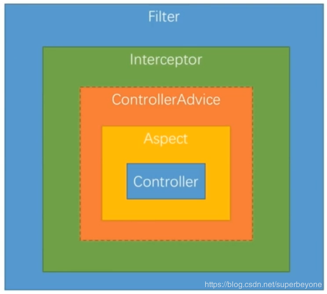

### springboot restful api 拦截
#### 三种方式
1. filter
2. interceptor (spring 框架自带的)
3. aspect

#### 三种方式执行顺序

> Filter -> Interceptor -> ControlerAdvice -> Aspect -> Controller

#### 优缺点对比
> 1. fiter:可以拿到原始的Http请求和响应的信息，只能获得其请求和响应携带的参数，但是却拿不到真正处理请求的控制器和方法的信息。
> 2. interceptor:既可以拿到原始的Http请求和响应的信息，也能拿到真正处理请求的方法信息，但是拿不到方法被调用时，真正调用的参数的值。
> 3. 可以拿到方法被调用时真正传进来的参数的值，但是却拿不到原始的Http请求和响应。
