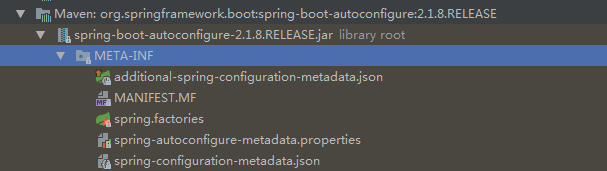
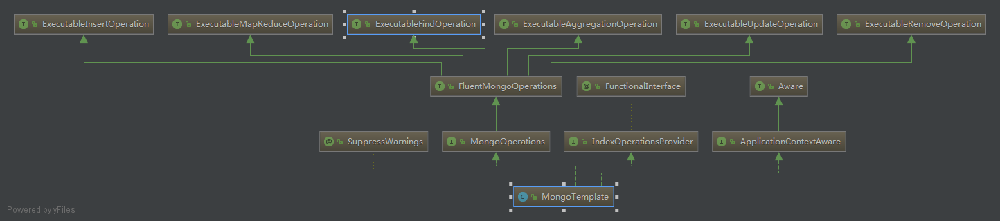

### 使用mongo

1. mongo使用引入的依赖
2. mongo配置相关
3. 由mongo使用引申的方法
4. mongoTemplate操作类的继承结构

#### 1.mongo使用引入的依赖

```java
<dependency>
      <groupId>org.springframework.boot</groupId>
      <artifactId>spring-boot-starter-data-mongodb</artifactId>
</dependency>
```

#### 2. mongo配置相关

> 需要配置啥，只需看源码的自动配置类 **MongoAutoConfiguration**
> 这里只需要配置mongo连接的主机和端口就可以
> ```java
>  spring.data.mongodb.host=192.168.12.191
>  spring.data.mongodb.port=27017
> ```

#### 3. 由mongo使用引申的方法

> 任何第三方中间件的使用，只要springboot集成了，都会有默认的自动配置
> 这时相关使用的步骤只需：引入依赖、查看自动化配置类、进行相应的默认配置
> 更改，所有的默认自动配置类在如下图的包中
> 

#### 4. mongoTemplate操作类的继承结构

> mongo增删改查的操作类继承结构图

> 核心的几个类和接口如下：
> 1. MongoTemplate
> 2. MongoOperations
